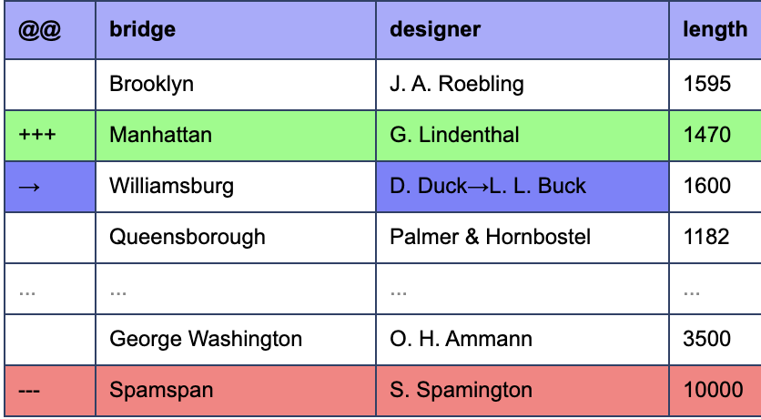

# Diff Tool to Compare Two Excel Spreadsheet Files

- in **Imitation** of https://www.textcompare.org/excel/
- github page https://yinger.github.io/ts-excel-compare/

## Libraries used in this Tool

- SheetJS https://sheetjs.com/
- Daff https://github.com/paulfitz/daff
- Handsontable https://handsontable.com/
- Antd https://ant.design/

## How to compare two excel files for differences?

Using this web tool, you can compare Excel document easily.
Just select first/original file in left window and second/modified file in right window. Your data will automatically be extracted. First sheet is automatically selected and you can change it in the dropdown.

Alternatively you can also copy and paste directly into left and right windows.
After that click on >>Diff<< button to find diff. The Diff data will be highlighted in a nice format.

For Excel export, you must have Excel or compatible spreadsheet application installed.

Otherwise you can also select all (`Ctrl-A`) and copy (`Ctrl-C`) and then paste in your spreadsheet software (`Ctrl-V`).

## What spreadsheet file formats does this Excel diff tool support?

- XLSX

## What does +++/— indicate?

- **+++** This has been added in second/modified file.
- **—--** This has been removed in second/modified file.
  
